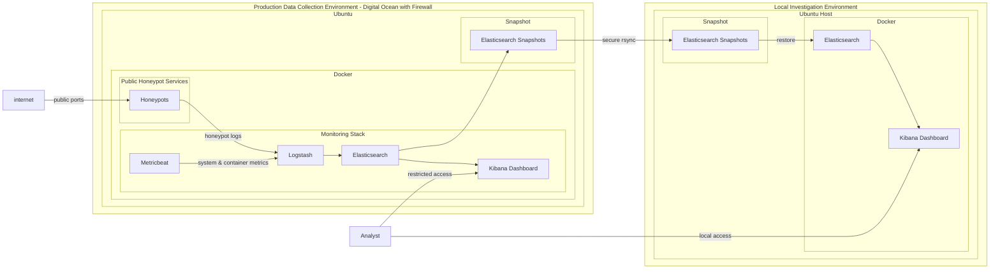

# Security Monitoring & Detection Lab (T-Pot + ELK + Snapshot Forensics)
Cloud-based honeypot telemetry pipeline for security monitoring, log analysis, and offline forensic investigation.

The system extends a baseline T-Pot deployment into a multi-environment architecture supporting:

- live honeypot telemetry collection
- infrastructure observability
- isolated forensic analysis via snapshot restoration

## System Overview
This project operates a cloud-deployed honeypot environment using T-Pot on DigitalOcean, integrated with the ELK stack for centralized log ingestion and analysis.

The original deployment was extended to support two operational planes:

Production telemetry system: internet-facing honeypots generating real attack traffic data
Investigation environment: locally restored Elasticsearch snapshots used for offline analysis and dashboard development

This separation reduces risk to production telemetry while enabling unrestricted investigative workflows.

## Architecture (V2)

## Design Rationale

### 1. Separation of Production and Analysis Workloads

The system isolates live telemetry collection from investigative activity to prevent:

- accidental impact on production data integrity
- performance degradation during analysis
- unsafe experimentation on live indices

### 2. Infrastructure Visibility Extension

T-Pot provides application-level telemetry, but lacks host and container observability.

Metricbeat was introduced to collect:

- system resource utilization
- Docker container metrics
- infrastructure-level signals for correlation with attack activity

### 3. Forensic Data Preservation Model

Elasticsearch snapshots are used to:

- preserve historical attack data
- enable replayable investigation environments
- decouple analysis from production constraints

## Data Flow
1. Internet traffic interacts with exposed honeypot services
2. Honeypots generate telemetry from observed interactions
3. Logstash aggregates and processes incoming logs
4. Metricbeat collects host and Docker resource metrics
5. Elasticsearch stores normalized telemetry and infrastructure data
6. Kibana provides dashboards and investigative workflows
7. Elasticsearch snapshots are periodically transferred to a local environment
8. Local Elasticsearch restores enable safer offline analysis and historical investigations

## Baseline System (T-Pot)
T-Pot provides a pre-integrated honeypot environment with:

- multiple emulated network services
- ELK stack for log aggregation
- prebuilt Kibana dashboards

### Observed Limitations
- Limited host/container-level observability by default
- Tight coupling between honeypot and analytics stack
- Production and analysis occur in the same environment
- Additional access control and hardening required before exposing Kibana interfaces beyond restricted administrative access
- Resource contention under higher traffic loads

These constraints informed the V2 redesign.

## Extended Capabilities (V1/V2)
- Added Metricbeat for infrastructure telemetry
- Introduced snapshot-based forensic workflow
- Separated production and investigation environments
- Enabled offline Kibana analysis for safer experimentation
- Improved observability across system, container, and network layers

## Operational Focus Areas

This environment is used to analyze:

- network scanning patterns across exposed services
- brute-force authentication attempts
- exploitation attempts against simulated services
- behavioral patterns of automated attack infrastructure

## Current Status
- Production honeypot environment operational and receiving live traffic
- ELK ingestion pipeline stable
- Metricbeat integrated and producing infrastructure telemetry
- Snapshot → restore pipeline functional
- Local investigation environment deployed
- Detection engineering and dashboard development in progress

## Engineering Takeaway

This project demonstrates a progression from a baseline honeypot deployment into a structured security telemetry system with:

- separation of production and analysis workflows
- extended infrastructure observability
- reproducible forensic investigation capability
- SOC-aligned data flow and monitoring design

## Acknowledgements
This project utilizes T-Pot honeypot platform as the core honeypot framework for generating and capturing malicious traffic.

Official project: https://github.com/telekom-security/tpotce

---

This project was deployed using infrastructure provided by DigitalOcean.

Platform: DigitalOcean (https://www.digitalocean.com/)

## Author

Cybersecurity-focused engineer transitioning into SOC / Blue Team roles with prior experience in software engineering, cloud operations, and production systems support.

Current focus areas:

- Threat detection engineering
- SIEM development (ELK stack)
- Incident response workflows
- Security monitoring
- Honeypot telemetry analysis
- Adversary simulation labs