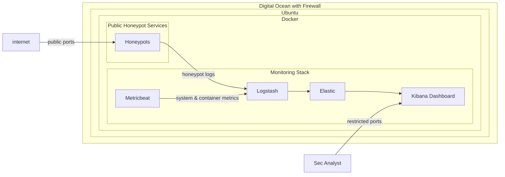

# Security Monitoring & Detection with T-pot Honeypot Platform on Digital Ocean
# Project Overview
Deployed and operated a cloud-based T-Pot honeypot environment on DigitalOcean to capture real-world attack traffic and analyze adversary behavior. Built an end-to-end security monitoring pipeline using the ELK stack and Metricbeat to collect, process, and visualize security telemetry.

This project simulates a lightweight SOC environment focused on log ingestion, attack observation, and behavioral analysis of internet-scale scanning and exploitation attempts.

This is a live honeypot environment currently collecting security telemetry

# Objectives
- Build a hands-on SIEM environment using the ELK stack
  - Log ingestion pipeline design
  - Kibana-based security visualization
- Deploy and operate a honeypot system for attack observation
- Analyze adversary behavior patterns including:
  - Network scanning
  - Brute-force authentication attempts
  - Exploitation attempts
- Develop analytical skills in:
  - Log correlation
  - Security monitoring
  - Anomaly detection

# Technologies Used
- T-Pot
- Docker
- Kibana
- Logstash
- Metricbeat
- DigitalOcean
- Linux
- Ansible
- Networking/firewall

# Architecture

# Data Flow
- Internet traffic interacts with exposed honeypot services
- Honeypots capture malicious interaction attempts and generate logs
- Logstash aggregates and processes security events
- Metricbeat collects system and container-level metrics
- Elasticsearch stores normalized security data
- Kibana provides visualization and analysis dashboards for investigation
- Analysts interact with the Kibana through restricted access utilizing Digital Ocean filewall.

# Current Status
- Honeypot environment is actively collecting live traffic
- Logging pipeline is fully operational (ELK + Metricbeat)
- Data collection phase in progress; initial exploratory analysis and detection design in progress

# Planned analysis phase
- Attack pattern analysis (scanning, brute force, exploitation attempts)
- Kibana dashboard development for security visibility
- MITRE ATT&CK mapping of observed behaviors
- Detection rule creation for suspicious activity

## Acknowledgements

This project utilizes T-Pot honeypot platform as the core honeypot framework for generating and capturing malicious traffic.

Official project: https://github.com/telekom-security/tpotce

---

This project was deployed using infrastructure provided by DigitalOcean.

Platform: DigitalOcean (https://www.digitalocean.com/)

## Author

Cybersecurity-focused engineer transitioning into SOC / Blue Team roles.  
Focused on:
- Threat detection engineering  
- SIEM development (ELK stack)  
- Incident response workflows  
- Adversary simulation labs  