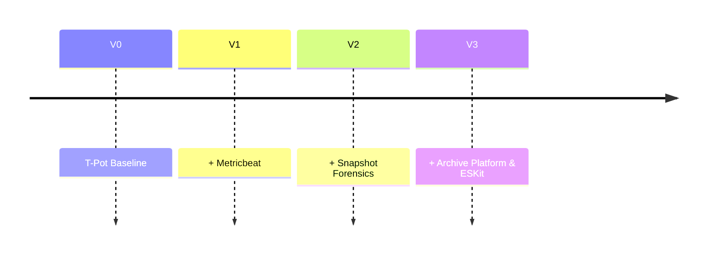
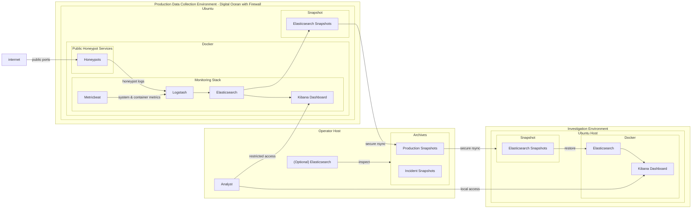

# Security Monitoring & Detection Lab (T-Pot + ELK + Snapshot Forensics)

Multi-environment security telemetry platform built on T-Pot and ELK, supporting live attack collection, infrastructure monitoring, and offline forensic investigation through Elasticsearch snapshot archives.

## Project Summary

This project evolved through three architectural iterations:
- **V0:** Baseline T-Pot deployment for collecting real-world attack telemetry
- **V1:** Added infrastructure observability with Metricbeat
- **V2:** Separated production and investigation environments using snapshot-based workflows
- **V3:** Introduced centralized snapshot archive management, an Operator Host, and ESKit for multi-cluster snapshot operations



## Table of Contents

- [System Overview](#system-overview)
- [Architecture (V3)](#architecture-v3)
- [Design Rationale](#design-rationale)
- [Data Flow](#data-flow)
- [Baseline System (T-Pot)](#baseline-system-t-pot)
- [Observed Limitations on Baseline System](#observed-limitations-on-baseline-system)
- [Extended Capabilities (V1/V2)](#extended-capabilities-v1v2)
- [Observed Limitations Identified in V1/V2](#observed-limitations-identified-in-v1v2)
- [Extended Capabilities (V3)](#extended-capabilities-v3)
- [Snapshot Archive Management with ESKit](#snapshot-archive-management-with-eskit)
- [Operational Focus Areas](#operational-focus-areas)
- [Key Design Decisions](#key-design-decisions)
- [Current Status](#current-status)
- [Engineering Takeaway](#engineering-takeaway)
- [Technologies](#technologies)
- [Acknowledgements](#acknowledgements)

# Security Monitoring & Detection Lab (T-Pot + ELK + Snapshot Forensics)
Multi-environment security telemetry platform built on T-Pot and ELK, supporting live attack collection, infrastructure monitoring, and offline forensic investigation through Elasticsearch snapshot archives.

The system extends a baseline T-Pot deployment into a multi-environment architecture supporting:

- live honeypot telemetry collection
- infrastructure observability
- isolated forensic analysis via snapshot restoration

## System Overview
This project operates a cloud-deployed honeypot environment using T-Pot on DigitalOcean, integrated with the ELK stack for centralized log ingestion and analysis.

The original deployment was extended to support two operational planes:

- Production telemetry system: internet-facing honeypots generating real attack traffic data
- Investigation environment: locally restored Elasticsearch snapshots used for offline analysis and dashboard development

This separation reduces risk to production telemetry while enabling unrestricted investigative workflows.

## Architecture (V3)


## Design Rationale

### 1. Separation of Production and Analysis Workloads

The system isolates live telemetry collection from investigative activity to prevent:

- accidental impact on production data integrity
- performance degradation during analysis
- unsafe experimentation on live indices

### 2. Infrastructure Visibility Extension

T-Pot provides application-level telemetry, but lacks host and container observability.

Metricbeat was introduced to collect:

- system resource utilization
- Docker container metrics
- infrastructure-level signals for correlation with attack activity

### 3. Forensic Data Preservation Model

Elasticsearch snapshots are used to:

- preserve historical attack data
- enable replayable investigation environments
- decouple analysis from production constraints

## Data Flow
1. Internet traffic interacts with exposed honeypot services
2. Honeypots generate telemetry from observed interactions
3. Logstash aggregates and processes incoming logs
4. Metricbeat collects host and Docker resource metrics
5. Elasticsearch stores normalized telemetry and infrastructure data
6. Kibana provides dashboards and investigative workflows
7. Elasticsearch snapshots are periodically transferred to an operator host as archives.
8. Archives are transferred to the investigation environment.
9. Snapshots are restored into the investigation cluster for offline analysis and historical investigations.

## Baseline System (T-Pot)
T-Pot provides a pre-integrated honeypot environment with:

- multiple emulated network services
- ELK stack for log aggregation
- prebuilt Kibana dashboards

### Observed Limitations on Baseline System
- Limited host/container-level observability by default
- Tight coupling between honeypot and analytics stack
- Production and analysis occur in the same environment
- Additional authentication and hardening are required before exposing Kibana beyond administrative access
- Resource contention under higher traffic loads

These constraints informed the V2 redesign.

## Extended Capabilities (V1/V2)
- Added Metricbeat for infrastructure telemetry
- Introduced snapshot-based forensic workflow
- Separated production and investigation environments
- Enabled offline Kibana analysis for safer experimentation
- Improved observability across system, container, and network layers


### Observed Limitations Identified in V1/V2
- Production snapshots are subject to deletion or removal due to:
    - Storage Limitation
    - Exposed Internet Environment
- Analysis Environment may manipulate snapshots for investigation and development purposes
- Direct connection between production and analysis environment introduced additional SSH Key management
- Transferring snapshots between multiple hosts directly is not scalable in terms of managing direct connections and organizing snapshots. 
- As the environment evolved into a multi-cluster architecture, interactive Dev Tools workflows became an operational bottleneck for automation, snapshot discovery, and archive management.

These constraints motivated the V3 redesign and the introduction of ESKit as an operational control plane for snapshot archive management.

## Extended Capabilities (V3)

- Centralized snapshot archive management
- Removed direct SSH configuration among non-operator clusters
- Added an optional local Elasticsearch cluster to inspect and manage snapshot archives
- Introduced [ESKit](https://github.com/damixen/eskit), a custom Python tool, to manage archive and ES cluster data such as index, repository, and snapshots.
- Decoupled production data retention from analysis and experimentation environments


The Operator Host acts as a snapshot archive hub. Production clusters only create and export snapshots, while analysis clusters only consume archived data. ESKit provides the management layer that catalogs snapshot repositories, orchestrates restores, and simplifies multi-cluster archive workflows.

## Snapshot Archive Management with ESKit

Version 3 of this lab introduces an intermediate Operator Host that centralizes Elasticsearch snapshot archives and decouples production and analysis environments.

The Operator Host runs [ESKit](https://github.com/damixen/eskit), a lightweight CLI toolkit for managing Elasticsearch repositories, snapshots, indices, and restores across multiple clusters.

### Responsibilities
- Pull snapshot archives from production repositories
- Catalog repositories and snapshots locally
- Inspect snapshot metadata and compatibility information
- Distribute snapshots to analysis environments
- Restore snapshots into local Elasticsearch instances for investigation
- Manage multi-cluster archive workflows without direct SSH relationships between analysis and production environments

### Why ESKit?

As snapshot archives accumulate over time, manually tracking repositories, snapshots, and version compatibility becomes increasingly difficult. ESKit provides a cache-driven interface for:

```bash
eskit pull
eskit repo show
eskit snap create
eskit snap restore
eskit cat snap
```
This workflow transforms snapshots from simple backups into portable forensic datasets that can be archived, restored, and analyzed across multiple Elasticsearch environments.

ESKit acts as the operational control plane for the snapshot archive workflow, providing repository discovery, snapshot cataloging,  metadata inspection, and restore orchestration across multiple Elasticsearch environments.

## Operational Focus Areas

This environment is used to analyze:

- network scanning patterns across exposed services
- brute-force authentication attempts
- exploitation attempts against simulated services
- behavioral patterns of automated attack infrastructure

## Current Status
- Production honeypot environment operational and receiving live traffic
- ELK ingestion pipeline stable
- Metricbeat integrated and producing infrastructure telemetry
- Snapshot → restore pipeline functional
- Local investigation environment deployed
- SMB (port 445) case study completed, including dashboards and detection engineering workflows
- Archive management is operational in personal lab environment

## Key Design Decisions

- Separate production telemetry collection from investigation workloads
- Preserve attack telemetry through snapshot archives
- Centralize snapshot management through an Operator Host
- Reduce trust relationships between environments
- Enable reproducible offline investigations and detection development
- Treat snapshots as portable forensic datasets rather than backups

## Engineering Takeaway

This project demonstrates a progression from a baseline honeypot deployment into a structured security telemetry system with:

- separation of production and analysis workflows
- extended infrastructure observability
- reproducible forensic investigation capability
- SOC-aligned data flow and monitoring design
- centralized snapshot archive management for forensic preservation and cross-environment investigations

## Technologies

- T-Pot Honeypot Platform
- Elasticsearch
- Logstash
- Kibana
- Metricbeat
- Docker
- DigitalOcean
- Python
- ESKit
- Rsync
- Linux

## Acknowledgements
This project utilizes the T-Pot honeypot platform as the core honeypot framework for generating and capturing malicious traffic.

Official project: https://github.com/telekom-security/tpotce

---

This project was deployed using infrastructure provided by DigitalOcean.

Platform: DigitalOcean (https://www.digitalocean.com/)

## Author

Cybersecurity-focused engineer transitioning into SOC / Blue Team roles with prior experience in software engineering, cloud operations, and production systems support.

Current focus areas:

- Threat detection engineering
- SIEM development (ELK stack)
- Incident response workflows
- Security monitoring
- Honeypot telemetry analysis
- Adversary simulation labs