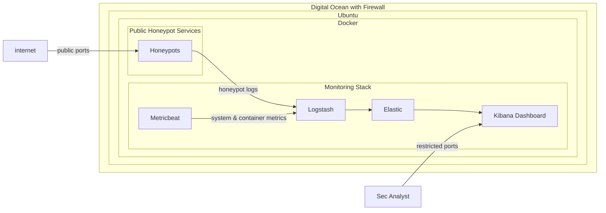

# Security Monitoring & Detection with T-pot Honeypot Platform on Digital Ocean
# Project Overview
Deployed and operated a cloud-based T-Pot honeypot environment on DigitalOcean to capture real-world network activities and analyze the behavior. Built an end-to-end security monitoring pipeline using the ELK stack and Metricbeat to collect, process, and visualize security telemetry.

This project simulates a lightweight SOC-style monitoring environment focused on log ingestion, activity observation, and behavioral analysis of internet-scale scanning and exploitation attempts.

This is a live honeypot environment currently collecting security telemetry

# Objectives
- Build a hands-on SIEM environment using the ELK stack
  - Log ingestion pipeline design
  - Kibana-based security visualization
- Deploy and operate a honeypot system for activity observation
- Analyze activity behavior patterns including:
  - Network scanning
  - Brute-force authentication attempts
  - Exploitation attempts
- Develop analytical skills in:
  - Log correlation
  - Security monitoring
  - Anomaly detection

# Report Framing and Terminology
Some screenshots retain original T-Pot / Kibana labeling where “attack” is used as a generic field for observed network activity. In this report, these events are interpreted as “activity” (e.g., scans and probes) rather than confirmed malicious attacks or attribution of intent.

# System Context (T-Pot Honeypot Platform)
T-Pot is an open-source honeypot platform that supports the deployment and management of multiple honeypots. It's a Docker-based service that manages honeypots and also provides an ELK stack for log collection and visualization. It also supports attack maps and investigative tools such as CyberChef and SpiderFoot.

Honeypots on T-Pot emulate various services with open ports, including HTTP, HTTPS, SSH, FTP, SMB, ADB, and Elasticsearch. The platform is highly customizable and supports selective deployment of honeypot services. Each honeypot generates logs for an activity event, which are collected by Logstash and ingested into Elasticsearch.

For my projects, I extended the ELK stack to support Metricbeat to collect System and Docker resources for broader activity correlation. I utilize the existing Kibana visualizations (Dashboards and panels) provided by T-Pot, and I have also created my own visualizations for resource utilization and case study investigation.

# Technologies Used
- T-Pot
- Docker
- Kibana
- Logstash
- Metricbeat
- DigitalOcean
- Linux
- Ansible
- Networking/firewall

# Architecture

# Data Flow
- Internet traffic interacts with exposed honeypot services
- Honeypots capture malicious interaction attempts and generate logs
- Logstash aggregates and processes security events
- Metricbeat collects system and container-level metrics
- Elasticsearch stores normalized security data
- Kibana provides visualization and analysis dashboards for investigation
- Analysts interact with the Kibana through restricted access utilizing Digital Ocean filewall.

# Current Status
- Honeypot environment is actively collecting live traffic
- Logging pipeline is fully operational (ELK + Metricbeat)
- Data collection phase in progress; initial exploratory analysis and detection design in progress

# Planned analysis phase
- Attack pattern analysis (scanning, brute force, exploitation attempts)
- Kibana dashboard development for security visibility
- MITRE ATT&CK mapping of observed behaviors
- Detection rule creation for suspicious activity

# Acknowledgements
This project utilizes T-Pot honeypot platform as the core honeypot framework for generating and capturing malicious traffic.

Official project: https://github.com/telekom-security/tpotce

---

This project was deployed using infrastructure provided by DigitalOcean.

Platform: DigitalOcean (https://www.digitalocean.com/)

## Author

Cybersecurity-focused engineer transitioning into SOC / Blue Team roles.  
Focused on:
- Threat detection engineering  
- SIEM development (ELK stack)  
- Incident response workflows  
- Adversary simulation labs  