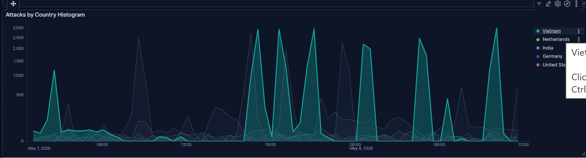
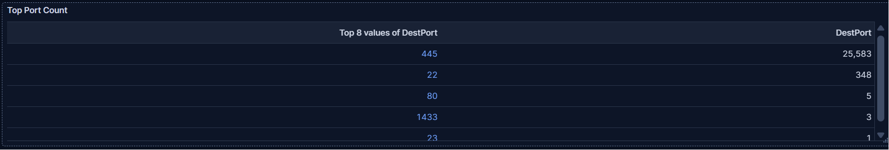
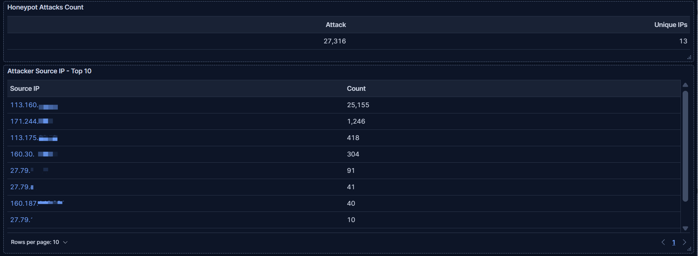
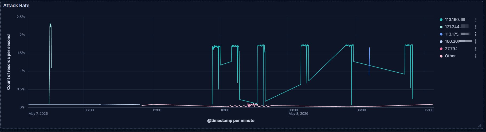

## From Spike Detection to Behavioral Correlation: Investigating Concentrated SMB Activity

### Investigation Status
Phase 1 Complete — Ongoing Investigation

## Summary
This is a case report investigating a spike in attacks against the T-Pot honeypot on a cloud platform. This investigation began by selecting anomalous activity from honeypot telemetry to explore how the SOC/detection/threat hunting workflow operate in practice. Then it will be expanded for further investigations.

## Investigation Objective
The objective of this investigation was to determine whether the observed traffic spike represented broad internet scanning activity, automated exploitation attempts, or coordinated targeting against a specific exposed service.

#### About T-Pot
T-Pot is an open-source honeypot platform that supports the deployment and management of multiple honeypots. It's a Docker-based service that manages honeypots and also provides an ELK stack for log collection and visualization. It also supports attack maps and investigative tools such as CyberChef and SpiderFoot.

Honeypots on T-Pot emulate various services with open ports, including HTTP, HTTPS, SSH, FTP, SMB, ADB, and Elasticsearch. The platform is highly customizable and supports selective deployment of honeypot services. Each honeypot generates logs for an attack event, which are collected by Logstash and ingested into Elasticsearch.

#### Note on T-Pot Usage
For my projects, I extended the ELK stack to support Metricbeat to collect System and Docker resources for broader attack correlation. I utilize the existing Kibana visualizations (Dashboards and panels) provided by T-Pot, and I have also created my own visualizations for resource utilization and case study investigation.

### Environment
- T-Pot
- Digital Ocean in the USA Northern CA Region
- ELK stack

### Data
T-Pot honeypot logs from May 2nd, 2026 to May 14th, 2026

## Phases
- Initial Detection & Triage
- Traffic Characterization
- Historical Correlation
- Threat Encichment
- Conclusions
- Detection Recommendation

## Initial Detection & Triage

The histogram below was generated from attack data collected by the T-Pot honeypot from May 2, 2026, to May 14, 2026. By looking at the histogram below, I picked the spike. A couple of reasons:
1. The focus was on investigating any spikes, regardless of port stats.
2. It was the first major spike after I integrated Metricbeat into the ELK to analyze the system and Docker resources.

Start: May 7, 2026 @ 01:04:38.892
End: May 8, 2026 @ 12:50:17.396

Narrowing the range revealed several spikes across multiple countries. The attack shows a pattern of consistent spikes. Instead of narrowing to more specific spikes, I decided to keep the time range, since those spikes could be related and contribute to a broader correlation.

The first observation is that these spikes suggest an automated system repeatedly scanning or attempting to access the exposed services.

### About port 445
Port 445 is used for the Server Message Block protocol. SMB is a network file-sharing protocol commonly used for sharing files, printers and remote resource communication in Windows environments. 

SMB has been exploited over the last decade, and the most famous attack was the 2017 WannaCry ransomware attack, which affected more than 300K computers in 150 countries. 

## Traffic Characterization

Looking at the countries where those attacks originated, Vietnam was associated with the most spikes observed. So, I set the filter for Vietnam.

The distribution of destination ports shows that port 445 was the most common for this spike. The concentration toward port 445 suggests focused targeting of SMB services.

The table below shows the top source IP addresses of attacks, including 113.160.xxx.xxx dominates most of the attack count.

And the top IP address targets only port 445.

The ASN correlation indicates that the attack originates from VNPT Corp, Vietnam Posts and Telecommunications Group, a Vietnamese ISP.

There are 4 IP addresses originating from the same AS, but based on the attack volume distribution, it suggests separate attacks rather than coordinated distributed behavior, and the dominant activity appears concentrated around a single source IP targeting port 445. So, I will focus on this IP address.

The top IP stands out for the attack rate, showing a uniform pattern with the same maximum rate.

The repeated periodic behavior strongly suggests automated tooling or scripted activity.

The table below shows several data points, but the focus is on the average and maximum session durations for IPs.

And by looking at the number for the top IP address, the average duration of 7 seconds is higher than typical scanning, such as nmap. The maximum observed session duration was approximately 13 minutes. The longer session durations suggest behavior more consistent with focused interaction or exploitation attempts than mass high-speed scanning.  

Just to check the average session times for other ports, and it does not show any significantly longer sessions.

## Current Assessment

Based on the observed traffic patterns, the activity currently appears more consistent with focused SMB interaction or automated exploitation attempts than broad Internet-wide reconnaissance scanning.

Key indicators include:

- Heavy concentration toward port 445
- Low destination port diversity
- Repeated periodic traffic spikes
- Long-lived sessions from dominant source IPs
- Consistent attack rate patterns

At this stage, successful exploitation cannot be confirmed, and additional historical correlation and protocol-level analysis are required.

### Investigation Limitations

The current investigation is limited to telemetry collected by the honeypot platform and associated ELK visualizations.

The following limitations apply:

- Full packet payload analysis was not performed
- SMB transaction contents were not inspected
- Successful exploitation or payload delivery could not be confirmed
- Attribution beyond ASN-level correlation remains inconclusive

Further investigation will focus on historical behavior correlation and protocol-level analysis.

## Historical Correlation
To Be Continued...

