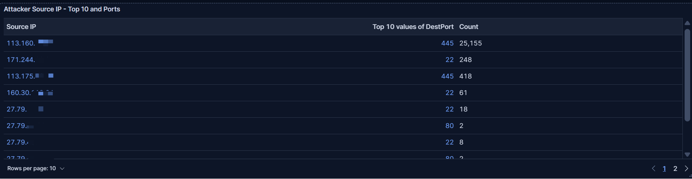
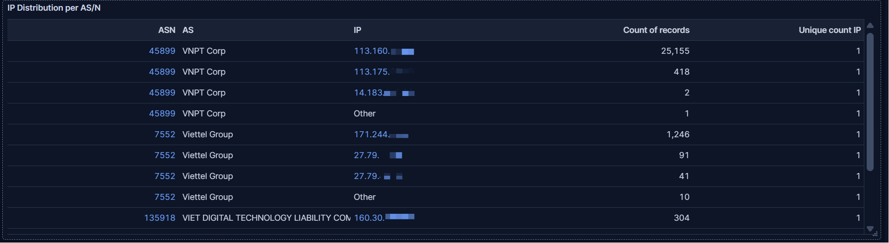
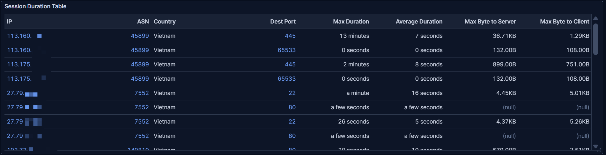
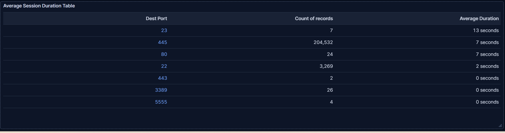

## Traffic Characterization

Looking at the countries where those activities originated, Vietnam was associated with the most spikes observed. So, I set the filter for Vietnam.

The distribution of destination ports shows that port 445 was the most common for this spike. The concentration toward port 445 suggests focused targeting of SMB services.

The table below shows the top source IP addresses of activities with 113.160.xxx.xxx accounting for the majority of observed activity.

And the top IP address targets only port 445.

The ASN correlation indicates that the activity originates from VNPT Corp, Vietnam Posts and Telecommunications Group, a Vietnamese ISP.

There are 4 IP addresses originating from the same AS, but based on the activity volume distribution,the observed activity did not provide sufficient evidence of coordinated distributed behavior, and the dominant activity appears concentrated around a single source IP targeting port 445. So, I will focus on this IP address.

The top IP stands out for the activity rate, showing a uniform pattern with the same maximum rate.

The repeated periodic behavior strongly suggests automated tooling or scripted activity.

The table below shows several data points, but the focus is on the average and maximum session durations for IPs.

And by looking at the number for the top IP address, the average duration of 7 seconds is higher than typical scanning, such as nmap. The maximum observed session duration was approximately 13 minutes. The longer session durations suggest behavior more consistent with focused interaction or exploitation attempts than mass high-speed scanning.  

Just to check the average session times for other ports, and it does not show any significantly longer sessions.

## Current Assessment

Based on the observed traffic patterns, the activity currently appears more consistent with focused SMB interaction or automated exploitation attempts than broad Internet-wide reconnaissance scanning.

Key indicators include:

- Heavy concentration toward port 445
- Low destination port diversity
- Repeated periodic traffic spikes
- Long-lived sessions from dominant source IPs
- Consistent activity rate patterns

At this stage, successful exploitation cannot be confirmed, and additional historical correlation and protocol-level analysis are required.

### Investigation Limitations

The current investigation is limited to telemetry collected by the honeypot platform and associated ELK visualizations.

The following limitations apply:

- Full packet payload analysis was not performed
- SMB transaction contents were not inspected
- Successful exploitation or payload delivery could not be confirmed
- Attribution beyond ASN-level correlation remains inconclusive

Further investigation will focus on historical behavior correlation and protocol-level analysis.