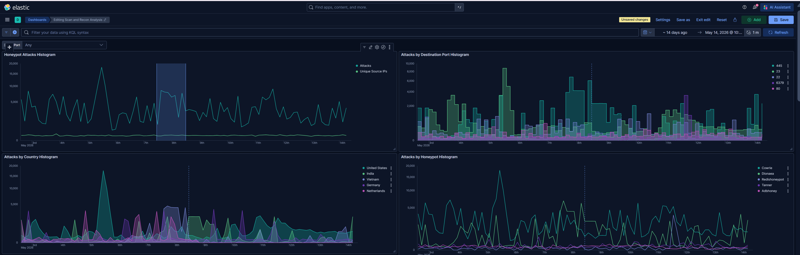

## From Spike Detection to Behavioral Correlation: Investigating Concentrated SMB Activity

### Investigation Status
Phase 3 Complete — Ongoing Investigation

## Summary
This is a case report investigating a spike in activities against the T-Pot honeypot on a cloud platform. This investigation began by selecting anomalous activity from honeypot telemetry to explore how the SOC/detection/threat hunting workflow operate in practice. This investigation will be expanded in future phases.

## Investigation Objective
The objective of this investigation was to determine whether the observed traffic spike represented broad internet scanning activity, automated exploitation attempts, or coordinated targeting against a specific exposed service.

### Environment
- T-Pot
- DigitalOcean (US-based region, Northern California)
- ELK stack

### Data
T-Pot honeypot logs from May 2nd, 2026 to May 14th, 2026

## Phases
- [Phase 1 - Initial Detection & Triage](01-initial-detection-and-triage/report.md)
- [Phase 2 - Traffic Characterization](02-traffic-characterization/report.md)
- [Phase 3 - Historical Correlation](03-historical-correlation/report.md)
- [Phase 4 - Thread Enrichment](04-threat-enrichment/report.md)
- [Phase 5 - Conclusions](05-conclusions/report.md)
- [Phase 6 - Detection Recommendations](06-detection-recommendations/report.md)

## Screenshots

## Skills Demonstrated
- ELK Stack
- Kibana Visualization
- Threat Hunting
- Historical Correlation
- Network Telemetry Analysis
- Honeypot Operations
- SIEM Investigation Workflow