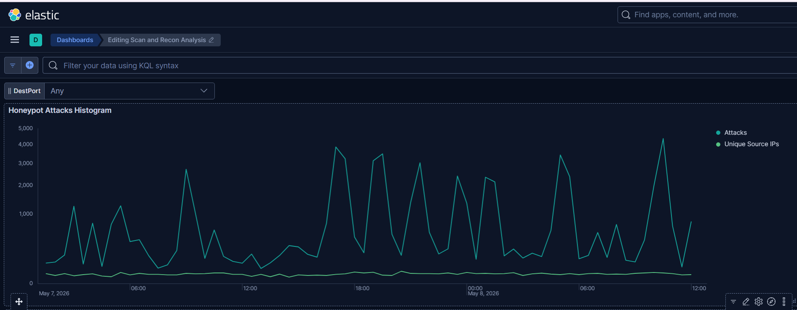

# Initial Detection & Triage

The histogram below was generated from activity data collected by the T-Pot honeypot from May 2, 2026, to May 14, 2026. By looking at the histogram below, I picked the spike. A couple of reasons:
1. The focus was on investigating any spikes, regardless of port stats.
2. It was the first major spike after I integrated Metricbeat into the ELK to analyze the system and Docker resources.

Start: May 7, 2026 @ 01:04:38.892
End: May 8, 2026 @ 12:50:17.396

Narrowing the range revealed several spikes across multiple countries. The activity shows a pattern of consistent spikes. Instead of narrowing to more specific spikes, I decided to keep the time range, since those spikes could be related and contribute to a broader correlation.

The first observation is that these spikes suggest an automated system repeatedly scanning or attempting to access the exposed services.

### About port 445
Port 445 is used for the Server Message Block protocol. SMB is a network file-sharing protocol commonly used for sharing files, printers and remote resource communication in Windows environments. 

SMB has been exploited over the last decade, and the most famous attack was the 2017 WannaCry ransomware attack, which affected more than 300K computers in 150 countries. 

Further investigation will focus on traffic analysis.

**Phase 1** | [Phase 2 >>](../phase2/README.md)
