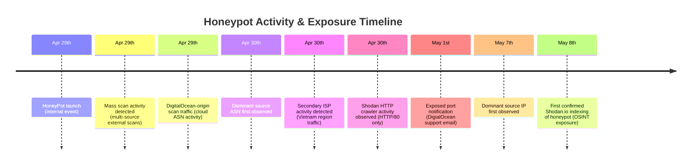

# Historical Correlation

My objectives for this historical correlation are to find evidence for the following questions:
- Do I see past activities from the dominant IP address?
- How did it potentially discover my honeypot?
    - Do I see any scanning-type activities from the address?
- If not, what else could contribute to the discovery of my honeypot?

Based on the questions, my current hypotheses are:
- Botnet scanning 445 all the time, and it happened to find this IP.
- My server got listed on Shodan.io or similar, so that information is made public, and the exposed service became discoverable through public indexing platform.
- Are there any other servers that are maybe working together for scanning/exploiting?

The start time range has now been adjusted to include the honeypot's inception.

Range:
- Apr 29, 2026 @ 00:00:00.000
- May 8, 2026 @ 12:50:17.396

The top IP is first seen on May 7th, 2026, which falls into the previous time range. So the spike observed from this IP was the first appearance of the IP address, which shows that there is no observation for the previous activity from this IP.
![[2026-05-18_08-46-33-topip-first-appearance.png]](screenshots/2026-05-18_08-46-33-topip-first-appearance.png)

This shows ASN:45889 annotated on the blue line and the dominant IP on the red line, illustrating the timeline of their emergence relative to the honeypot launch.
![[2026-05-18_09-03-58-first-apperance-45899.png]](screenshots/2026-05-18_09-03-58-first-apperance-45899.png)
The ASN appears within the day, and the IP shows up about a week later. No significant temporal correlation was identified from the timeline.

Looking at those IPs from the ASN, there are 15 unique IPs.
![[2026-05-18_09-07-46-IP-Port-stats-45899.png]](screenshots/2026-05-18_09-07-46-IP-Port-stats-45899.png)
And most of them targeted port 445, so I do not see wide scan-like behavior from this.

Taking a quick look at the second IP from the table above, it appeared after the dominant, and the session duration ranges from 8 sec to 2 minutes, so it doesn't seem to be a multi-port scan. For other IPs, they appeared before those two top IPs, but the session duration average is 2 minutes. So again, it doesn't align with the likelihood of quick-scan behavior.

Since ASN-level analysis did not reveal evidence of broader coordinated scanning, the investigation scope was expanded to the country level to identify whether related infrastructure or scanning behavior existed elsewhere within the same regional traffic patterns. 

![[2026-05-18_09-42-26-activitys-from-VN.png]](screenshots/2026-05-18_09-42-26-activity-from-VN.png)
There are a couple of spikes, and I will exclude the dominant IP spike by filtering it.

The 445 is still the dominant port. Other ports are 80, 21, 22.
![[2026-05-18_10-03-01-IP-Port-stats-wo-dominant-ip.png]](screenshots/2026-05-18_10-03-01-IP-Port-stats-wo-dominant-ip.png)

Based on the uniport per IP, the maximum unique port count is 2.
![[2026-05-18_10-07-57-IP-Port-stats-2.png]](screenshots/2026-05-18_10-07-57-IP-Port-stats-2.png)
This suggests the activity was not consistent with broad multi-port reconnaissance behavior.

It’s worth mentioning the ASNs for context. FPT Telecom Company is another leading ISP in Vietnam. VNPT Corp and FPT are two of the three leading ISPs in Vietnam.
VNPT is a state-owned enterprise, and FPT is in the private sector.
![[2026-05-18_10-11-48-another-high-count-asn.png]](screenshots/2026-05-18_10-11-48-another-high-count-asn.png)

The graph below shows the FPT in red and the VNPT in blue.
![[2026-05-18_10-29-22-asn-annotated.png]](screenshots/2026-05-18_10-29-22-asn-annotated.png)
It’s not sufficient to indicate any correlation between those ISPs.

Based on the data I have investigated so far, it suggests that no mass scanning occurred from Vietnam prior to the spike on May 8th, 2026, and that port 445 remained the dominant targeted service throughout the observed activity. I don't have enough data to correlate those ASN or server relationships for scanning/exploiting roles or collaboration at this time, but they mostly targeted port 445 rather than performing multi-port scanning.

How about the possibility of Shodan.io exposure? I noticed the honeypot was listed on Shodan on May 8th, but I don't know when exactly. So the next step is to identify activity associated with Shodan or other internet-wide scanning platforms. 

This is the port count per IP address, and several IPs scanned more ports, which appears to be multi-port scanning behavior.
![[2026-05-18_10-49-03-top-IP-Port-Stats-All.png]](screenshots/2026-05-18_10-49-03-top-IP-Port-Stats-All.png)
* Later investigation showed the top IP address is from Digital Ocean, and it's likely that it was for the provider's security scan, as the timing of the scan was shortly after my launch of the VPS/Honeypot, and the timing aligned with an exposure notification email received from DigitalOcean support regarding an intentionally exposed service.

Those are the top ASNs, but I don't have enough idea about them except for DigitalOcean, LLC.
![[2026-05-18_10-50-04-TOP-ASN.png]](screenshots/2026-05-18_10-50-04-TOP-ASN.png)

T-Pot IP reputation data identified approximately 3% of observed source IPs as mass scanners.
![[2026-05-18_10-50-28-reputation.png]](screenshots/2026-05-18_10-50-28-reputation.png)

Let's filter with a mass scanner
![[2026-05-18_10-54-43-mass-scan-histogram.png]](screenshots/2026-05-18_10-54-43-mass-scan-histogram.png)

The data shows broader port coverage with a relatively shorter duration.
![[case-study/smb-activity-spike-honeypot/screenshots/2026-05-18_11-05-54-mass-scanner-port-stats.png]](screenshots/2026-05-18_11-05-54-mass-scanner-port-stats.png)

And interestingly, Censys, Inc is in the list of ASNs, which is an internet-wide scanning and indexing platform similar to Shodan. I also observed that my honeypot IP address was listed on their website at the time of this investigation. So it's possible that this honeypot was exposed on other similar platforms.
![[2026-05-18_10-53-32-mass-scanner-asn.png]](screenshots/2026-05-18_10-53-32-mass-scanner-asn.png)

Additionally, I searched Shodan.io activities, and there are some, but they're on port 80.
![[2026-05-18_11-04-00-shodan.png]](screenshots/2026-05-18_11-04-00-shodan.png)
I did not perform a further query on Shodan.io.
## Current Assessment
Historical correlation did not identify evidence of broad reconnaissance behavior from the dominant source IP or associated ASN activity. The findings suggest the SMB targeting may have originated from public Internet indexing visibility or from targeted SMB reconnaissance against cloud-hosted infrastructure.

Key indicators include:
- Heavy concentration toward port 445 from other IPs on the associated ASN and Vietnam.
- Multi-port scanning observed from various IP addresses.
- Observed access from the internet indexing platforms such as Censys.

## Timeline

## Additional Observations
- Observed Digital Ocean provider scan activities, which correlated with the receipt of a potential port abuse reporting email from the Digital Ocean support team. This observation also provided visibility into the cloud provider’s exposure monitoring and security notification process.
- Mass-scanning and indexing-related activity was observed within hours of the honeypot deployment, highlighting how quickly newly exposed cloud infrastructure becomes visible to automated Internet-wide scanning ecosystems. 

## Investigation Limitations

- While reviewing traffic from the DigitalOcean scanner, I realized that the current investigation primarily focused on honeypot activity events rather than on all observed network activity. Lightweight scanning activity detected at the network layer by Suricata may not generate corresponding honeypot interaction logs, particularly for incomplete or low-interaction connection attempts.

- This investigation was conducted using telemetry collected from a single publicly exposed honeypot instance. As a result, observations are limited to activity directed toward this specific host and do not provide full visibility into broader scanning scope across other Internet-facing systems or cloud infrastructure ranges.

- While the observed behavior was not consistent with broad multi-port reconnaissance against this host, the possibility of wider Internet-scale SMB scanning activity outside the visibility of this sensor cannot be excluded.

- Future investigation could include visualization and analysis of Suricata network telemetry to better characterize lightweight scanning behavior and broader reconnaissance activity.

Further investigation will focus on threat enrichment and protocol-level analysis.

[<< Phase 2](../phase2/README.md)
 | **Phase 3** | [Phase 4 >>](../phase4/README.md)
