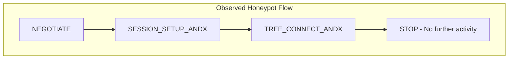
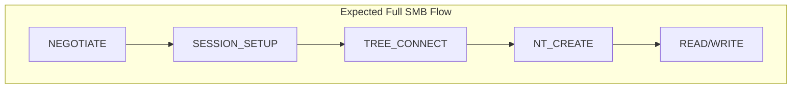

# Threat Enrichment

## Environment

### Methodology
Observations are derived from Suricata SMB telemetry, Kibana visualizations, Dionaea behavior analysis, and controlled SMB client experiments conducted during the investigation.

### Time Range
The time range remained the same as the spike detection from previous phases:
- May 7, 2026 @ 01:04:38.892
- May 8, 2026 @ 12:50:17.396

### Honeypot
The honeypot involved in this case study is **Dionaea**, which simulates various services, including but not limited to SMB and FTP.

### Data Scope
**Suricata** events will be used for this phase mainly because:
- It logs network layer events on port 445
- It logs SMB commands.
    - Observed that Dionaea does not log SMB operation details, which are required for my case study.

## SMB Command Classification Definition
First, I would like to break down SMB commands into phases of activity for classification.
1. **Negotiation** - Agree on SMB version/dialect between server and client.
    - e.g. **SMB1_COMMAND_NEGOTIATE_PROTOCOL**
2. **Session Establishment** - Establish session/authentication.
    - e.g. **SMB1_COMMAND_SESSION_SETUP_ANDX**
3. **Resource Access** - Connect to a share/resource.
    - e.g. **SMB1_COMMAND_TREE_CONNECT_ANDX**
4. **File Access Attempt** - Attempt to create or open files.
    - e.g. **SMB1_COMMAND_NT_CREATE_ANDX**
5. **File Interaction** - Read/Write
    - e.g. **SMB1_COMMAND_READ**

These clarifications would help to visualize and identify the possible intentions of activities.  

## Kibana Dashboard
A custom Kibana dashboard was created for this investigation, which shows SMB statistics such as top SMB commands, SMB command funnel, and timeline of SMB commands.

## Targeted Analysis on the Dominant Source IP
Focusing on the dominant IP from the previous phase, two major commands are:  
- **SMB1_COMMAND_NEGOTIATE_PROTOCOL**
- **SMB1_COMMAND_SESSION_SETUP_ANDX**

Also, **SMB1_COMMAND_TREE_CONNECT_ANDX** was observed 12 times for the time range, and there were no observations of commands associated with deeper file interaction or post-authentication SMB activity.
![[smb-command-dominant-ip.png]](screenshots/2026-05-26_09-10-57-smb-command-dominant-ip.png)

## SMB Engagement Timeline
The graph below shows the timeline of SMB commands. SMB Negotiation followed by session setups, so those are mostly combined operations.
![[negotiate-session-ratio-dominant-ip.png]](screenshots/2026-05-27_18-05-27-negotiate-session-ratio-dominant-ip.png)

## TCP 445 vs Parsed SMB Sessions
In the previous phase, I discovered a limitation in Dionaea: it would not generate events for activities that only establish a TCP connection on port 445 without any subsequent SMB commands. That means that I could have missed port-scanning-type activities similar to Nmap's SYN scan.

To gain more insight into the potential intent of the activities, this graph shows the ratio of TCP 445 connections to observed SMB commands. As shown in the graph, most of the activities are intended to interact with SMB commands rather than exhibit port-scanning-like behavior. It's possible that port scanning occurred before SMB command interactions, but the number is very small.

![[access-and-smb-ratio.png]](screenshots/2026-05-26_14-52-14-access-and-smb-ratio.png)

## Broader Context
Looking at Vietnam itself, the command trend is the same as that of the dominant IP.
![[smb-command-stats-vn.png]](screenshots/2026-05-26_15-04-23-smb-command-stats-vn.png)

Also, looking at all countries, the funnel follows the same trend.
![[smb-funnel-all-may7-may8.png]](screenshots/2026-05-27_18-07-52-smb-funnel-all-may7-may8.png)

Extending the end date to May 22nd, 2026, and for all counties, I started to observe more file interactions.
![[smb-funnel-all.png]](screenshots/2026-05-27_18-09-45-smb-funnel-all-latest.png)

Based on the table below, the US has the highest count for data interaction commands.
![[smb-command-by-country-all-latest.png]](screenshots/2026-05-26_21-00-52-smb-command-by-country-all-latest.png)

So if I focus on the US, the funnel shows more resource accesses.
![[smb-funnel-us.png]](screenshots/2026-05-27_18-12-24-smb-funnel-us-latest.png)

## Observed SMB Session Flow

Overall, these observations suggest that the majority of SMB activity during the spike period consisted primarily of lightweight SMB reconnaissance and capability probing.

Now, the following are my analytical questions derived from the observation:

### Question 1: What does the honeypot/service expose by setting up sessions?
The key to this answer lies in what happens during negotiation and setup. In SMB, the client first negotiates which SMB dialect version the server supports. So it sends a list of SMB dialects. Then the server responds with the agreed version. SMB has evolved across multiple protocol generations, commonly referred to as SMB1, SMB2, and SMB3, and version choice is very important because SMB1 is known to be vulnerable. Then, during the session setup phase, the client attempts authentication using supported SMB authentication mechanisms. In configurations permitting null sessions, authentication may not be required for limited anonymous access. Based on this behavior, by performing only negotiation and session setup, the server exposes SMB versions and indicates whether resources are protected by authentication mechanisms. That alone gives enough information to fingerprint the server. 

For example, in this case study, the dominant IP address sends SMB dialects as follows for all of its activities:
- NT LM 0.12  - Legacy SMB1
- SMB 2.002
- SMB 2.???

This can be due to the scanner being older, or focused on compatibility, or maximizing the discovery of legacy SMB versions.

### Question 2: What could be the reasons for the spike in volume of such operations?
Repeated negotiation and session setup requests may indicate automated scanning behavior performing consistency checks, compatibility testing, or repeated capability discovery across SMB services.

### Question 3: What could be the reasons for not continuing further exploration of the server after the session is established?
There are many possibilities; it may indicate automated reconnaissance, compatibility testing, or scanning activity that terminated after protocol identification, rather than an interactive intrusion attempt.

## Additional Observations
During the investigation, several notable observations were made.
- Dionaea currently supports only SMB1/NT LM 0.12 dialect.
    - It explicitly checks the header for (\xffSMB), which is added by the SMB1 version.
        - SMB2/3 use a different protocol header signature (\xfeSMB).
    - It supports only NT LM 0.12, so negotiation would fail if the dialect is not supported by the client.
    - When using **smbclient** against Dionaea, these options are necessary.
        - -m NT1
        - --option='client min protocol=CORE'
- Port 445 can be blocked by ISPs or VPN providers.
    - I observed that scanning my honeypot from my local machine resulted in "filtered". After reviewing the firewall settings on DigitalOcean or on my local computer, I couldn't figure it out. But eventually, I found a webpage on my ISP's site listing blocked ports, and port 445 was one of them. 
    - I was able to access port 445 from my cybersecurity course lab VM or an instance on AWS.
- During the spike period, I didn't observe corresponding spikes in CPU, system, or network activity, but container metrics for network activity corresponded to the activity spikes.
        
![[activities-and-network.png]](screenshots/2026-05-26_15-41-38-activity-and-network.png)

## Limitations
- Because Dionaea primarily supports SMB1-oriented negotiation and session workflows, this case study may not fully reflect behavior associated with modern SMB2/SMB3 interactions.

## Current Assessment
Observed activities from the dominant IP strongly suggest automated SMB reconnaissance behavior focused on network service and share discovery, particularly involving SMB1/SMB2 capability probing, without evidence of successful exploitation or post-authentication interaction.

### Confidence Level: Moderate to High
Confidence is based on repeated SMB negotiation behavior, session setup patterns, dialect probing consistency, and absence of observed post-authentication activity.

## References
### MITRE ATT&CK
- https://attack.mitre.org/techniques/T1046/
- https://attack.mitre.org/techniques/T1135/
### Documentation
- https://learn.microsoft.com/en-us/windows-server/storage/file-server/file-server-smb-overview
- https://github.com/DinoTools/dionaea
- https://learn.microsoft.com/en-us/openspecs/windows_protocols/ms-cifs/089b6f3e-b91d-4659-83a7-3e50a1a5faf7
### Practical References
- https://www.hackingarticles.in/a-little-guide-to-smb-enumeration/
- https://www.youtube.com/watch?v=nxql9d5VtmA
- https://www.varonis.com/blog/smb-port

# Adddendum - Interpretation Update
## SESSION SETUP command status
Further investigation of the dominant IP revealed that the majority of SMB1_COMMAND_SESSION_SETUP_ANDX events remain at STATUS_MORE_PROCESSING_REQUIRED, with only 24 events resulting in STATUS_SUCCESS out of approximately 25,000 observed events. Additionally, I observed that SESSION_SETUP events consistently appeared as part of a sequential negotiation flow following SMB protocol negotiation, rather than as isolated requests.

In SMB1 with NTLMSSP authentication, STATUS_MORE_PROCESSING_REQUIRED typically indicates that the NTLM challenge-response exchange is still in progress, rather than a completed authentication. This aligns with observed NTLMSSP payload exchanges during session setup.
Further analysis of Dionaea's behavior indicates that the honeypot does not perform full authentication validation. Instead, it simulates SMB session establishment by accepting NTLMSSP authentication structures without verifying credentials against a backend authentication system. As a result, session establishment may succeed regardless of credential correctness.

Based on these observations, the low number of STATUS_SUCCESS events suggests that most SESSION_SETUP exchanges remained within the SMB session establishment (NTLMSSP negotiation) phase, without progressing into post-session SMB operations such as share access or file interaction.
This does not materially change the overall assessment of the traffic as automated SMB interaction, but it refines the interpretation of SESSION_SETUP status values and clarifies that they reflect protocol-level negotiation states rather than authentication success or failure.

[<< Phase 3](../phase3/README.md)
 | **Phase 4** | [Phase 5 >>](../phase5/README.md)

