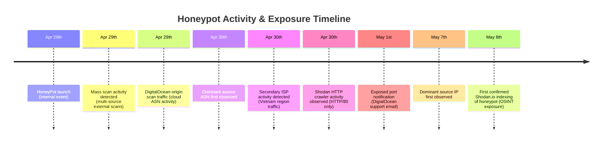

```mermaid  
timeline
  title Honeypot Activity & Exposure Timeline
      Apr 29th : HoneyPot launch (internal event)
      Apr 29th : Mass scan activity detected (multi-source external scans)
      Apr 29th : DigitalOcean-origin scan traffic (cloud ASN activity)
      Apr 30th : Dominant source ASN first observed
      Apr 30th : Secondary ISP activity detected (Vietnam region traffic)
      Apr 30th : Shodan HTTP crawler activity observed (HTTP/80 only)
      May 1st : Exposed port notificaiton (DigialOcean support email)
      May 7th : Dominant source IP first observed
      May 8th : First confirmed Shodan.io indexing of honeypot (OSINT exposure)
```